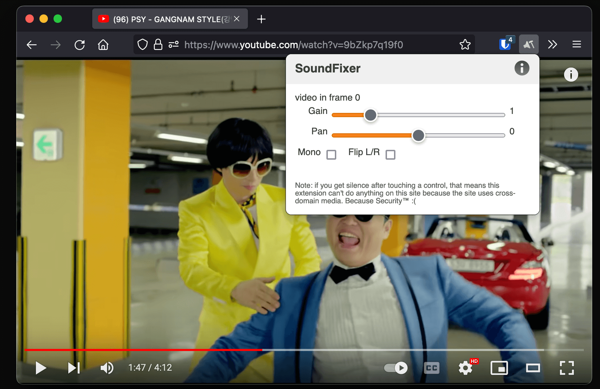

# SoundFixer 

A WebExtension that lets you fix annoying sound problems on the web (e.g. in YouTube videos): sound in one channel only, too quiet even at maximum volume, too loud even at minimum volume.

## Install

- [Get for Firefox](https://addons.mozilla.org/en-US/firefox/addon/soundfixer/)
- [Get for Chrome](https://chrome.google.com/webstore/detail/soundfixer/mbhbddecpoendcifccfckjkigbinefkg)

And ther you go. No more "[Plug your headphones only halfway into the jack](https://news.ycombinator.com/item?id=11912213)" :D

(Unfortunately, doesn't work on all websites — specifically, we're not allowed to use the Web Audio API from a cross-domain `<audio>` source. Thankfully, YouTube is not cross-domain!)

(Doesn't seem to work in Chromium/Opera currently because of permission issues. Even when allowing all URLs.)

## Contributing

By participating in this project you agree to follow the [Contributor Code of Conduct](https://contributor-covenant.org/version/1/4/) and to release your contributions under the Unlicense.

[The list of contributors is available on GitHub](https://github.com/unrelentingtech/soundfixer/graphs/contributors).

## License

This is free and unencumbered software released into the public domain.  
For more information, please refer to the `UNLICENSE` file or [unlicense.org](https://unlicense.org).
